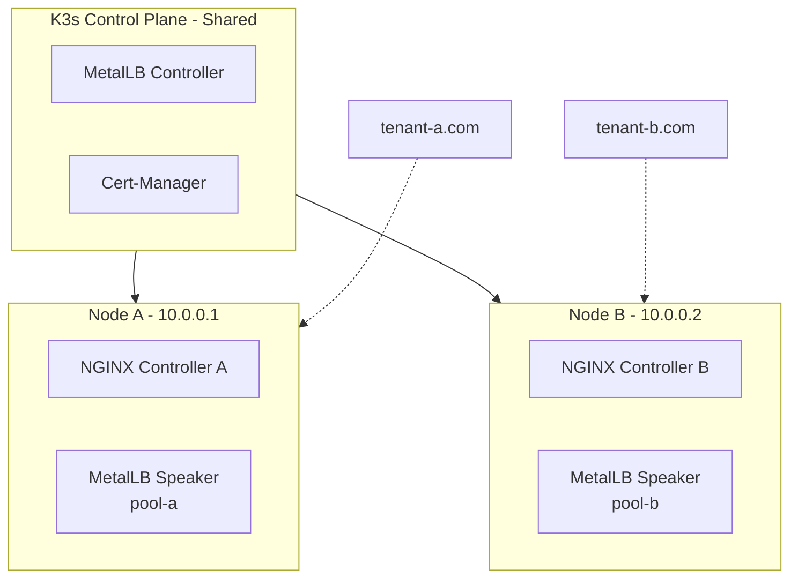

Running isolated ingress controllers on dedicated Kubernetes nodes with a shared
control plane presents specific networking challenges. After failed attempts
with K3s ServiceLB, MetalLB emerged as the solution for proper multi-tenant
bare-metal deployments.

## The Problem: Multi-Tenant Node Isolation

Requirements for multi-tenant infrastructure:

- Each tenant gets a dedicated physical node
- Complete network isolation (own IP, own ingress controller, own SSL
  certificates)
- All nodes share a single K3s control plane for unified management
- True independence - one tenant failure doesn't affect others

Goal: isolation benefits of separate clusters, with operational simplicity of
one cluster.

## Attempt 1: NGINX Ingress + K3s ServiceLB

**Configuration:**

```yaml
ingressClass: nginx-tenant-a
service:
  type: LoadBalancer
---
ingressClass: nginx-tenant-b
service:
  type: LoadBalancer
```

**Expected behavior:**

- Node A: `10.0.0.1`
- Node B: `10.0.0.2`
- Traffic routes to respective controllers based on destination IP

**Actual behavior:** K3s ServiceLB (Klipper) assigned the same IP to both
controllers. ServiceLB doesn't support dedicated IPs per node - it NATs through
whatever node port it selects.

**Result:** Both domains pointed to same IP, ingress controllers competing
for traffic. Isolation broken.

## Attempt 2: Traefik + K3s ServiceLB

**Configuration:**

```yaml
entryPoints:
  web-a:
    address: ":80"
service:
  type: LoadBalancer
---
entryPoints:
  web-b:
    address: ":80"
service:
  type: LoadBalancer
```

**Expected behavior:** Traefik's flexible EntryPoints would handle multiple
LoadBalancer services properly.

**Actual behavior:** Identical problem. ServiceLB doesn't care about ingress
controller type - still assigning single NAT'd IP for all LoadBalancer services.

Attempted solutions:

- Different EntryPoint names
- NodePort services with hostNetwork
- Various Traefik configurations

None solved the fundamental limitation: **ServiceLB cannot assign different
public IPs to different nodes.**

**Result:** Same IP conflict, no isolation.

## Attempt 3: NGINX Ingress + MetalLB

**The Realization:**

The ingress controller wasn't the problem. K3s ServiceLB was.

ServiceLB limitations for multi-node isolation:

1. Cannot assign specific IPs to specific nodes
2. Cannot route traffic based on destination IP
3. Cannot support multiple isolated LoadBalancer pools

### MetalLB Implementation

MetalLB provides proper LoadBalancer implementation for bare-metal Kubernetes.

**IP Address Pools:**

```yaml
apiVersion: metallb.io/v1beta1
kind: IPAddressPool
metadata:
  name: tenant-a-pool
spec:
  addresses:
    - 10.0.0.1/32
---
apiVersion: metallb.io/v1beta1
kind: IPAddressPool
metadata:
  name: tenant-b-pool
spec:
  addresses:
    - 10.0.0.2/32
```

**L2 Advertisement with Node Selection:**

```yaml
apiVersion: metallb.io/v1beta1
kind: L2Advertisement
metadata:
  name: tenant-a-l2
spec:
  ipAddressPools:
    - tenant-a-pool
  nodeSelectors:
    - matchLabels:
        node-pool: tenant-a
---
apiVersion: metallb.io/v1beta1
kind: L2Advertisement
metadata:
  name: tenant-b-l2
spec:
  ipAddressPools:
    - tenant-b-pool
  nodeSelectors:
    - matchLabels:
        node-pool: tenant-b
```

**Ingress Controllers Request Specific Pools:**

```yaml
service:
  type: LoadBalancer
  annotations:
    metallb.universe.tf/address-pool: tenant-a-pool
---
service:
  type: LoadBalancer
  annotations:
    metallb.universe.tf/address-pool: tenant-b-pool
```

### Traffic Flow

1. **MetalLB Controller**: Watches LoadBalancer services, assigns IPs from pools
2. **MetalLB Speaker** (DaemonSet): Announces IPs via L2 (ARP)
3. **L2Advertisement**: Ensures each node only announces its pool's IPs
4. External traffic to `10.0.0.1` → ARP resolves to node A → nginx-tenant-a
   handles it
5. External traffic to `10.0.0.2` → ARP resolves to node B → nginx-tenant-b
   handles it

### Architecture Diagram



## Benefits

### True Tenant Isolation

Each tenant receives:

- Dedicated public IP (from its pool)
- Own ingress controller
- Own SSL certificates
- Own node (scheduled via labels)

One tenant crashes? Others remain unaffected.

### Shared Control Plane

- Single K3s cluster management
- Unified GitOps deployment
- Shared secrets management
- Centralized monitoring

### Simple Scaling

Adding a new tenant:

```bash
# Add IP pool to MetalLB
kubectl apply -f - <<EOF
apiVersion: metallb.io/v1beta1
kind: IPAddressPool
metadata:
  name: tenant-c-pool
spec:
  addresses:
    - 10.0.0.3/32
---
apiVersion: metallb.io/v1beta1
kind: L2Advertisement
metadata:
  name: tenant-c-l2
spec:
  ipAddressPools:
    - tenant-c-pool
  nodeSelectors:
    - matchLabels:
        node-pool: tenant-c
EOF
```

### Cost Effectiveness

- Control plane node: 4GB RAM - hosts shared services
- Tenant nodes: 2GB RAM each - dedicated workloads
- No expensive managed load balancers
- Pay only for required resources

## Technical Insights

### K3s ServiceLB Scope

ServiceLB is suitable when:

- Single node deployment OR
- Node-agnostic traffic routing OR
- Using NodePort with external load balancer

For multi-node isolated-traffic requirements, ServiceLB is insufficient.

### Ingress Controller Independence

The ingress controller choice (NGINX vs Traefik) was irrelevant. The
LoadBalancer implementation layer (ServiceLB) was the actual bottleneck. Once
replaced with MetalLB, any ingress controller functions correctly.

### MetalLB as Bare-Metal LoadBalancer

Managed Kubernetes (GKE, EKS, AKS) provides real LoadBalancers. On
bare-metal/VPS deployments, MetalLB + careful IP pool design achieves
managed-cluster-like behavior.

### L2 Mode vs BGP

MetalLB supports both L2 (ARP) and BGP modes. For VPS setups:

- **L2 mode**: Works immediately - speakers announce IPs via ARP
- **BGP mode**: Requires router configuration and peering setup

L2 mode proves sufficient for most bare-metal deployments.

## Alternative Approaches

### Separate Clusters Per Tenant

**Pros**: Maximum isolation
**Cons**:
- N control planes to manage
- No shared services (duplicate infrastructure)
- Complex inter-cluster networking

### Single Ingress + Host-Based Routing

**Pros**: Simple
**Cons**:
- All traffic through one node (SPOF)
- No true isolation
- Resource contention

### External Load Balancer (HAProxy, etc.)

**Pros**: Functional
**Cons**:
- Additional component management
- More complex routing rules
- Extra hop for traffic

MetalLB provides the isolation of separate clusters with the simplicity of
single ingress.

## Implementation Summary

**For multi-tenant Kubernetes on bare-metal/VPS with dedicated nodes per
tenant:**

1. Use **MetalLB** for LoadBalancer implementation
2. Create **IP pools per node/tenant**
3. Use **L2Advertisement with node selectors**
4. Use **any ingress controller** (NGINX, Traefik, etc.)
5. Ingress controllers request specific pools via annotations

This architecture delivers:

- Isolation of separate clusters
- Manageability of one cluster
- Economics of shared control plane
- Flexibility to scale per-tenant

K3s + MetalLB + any ingress controller = ideal solution for hosting multiple
isolated workloads on dedicated nodes with shared management.

---

**Resources:**

- [MetalLB Documentation](https://metallb.universe.tf/)
- [K3s ServiceLB Limitations](https://docs.k3s.io/networking#service-load-balancer)
